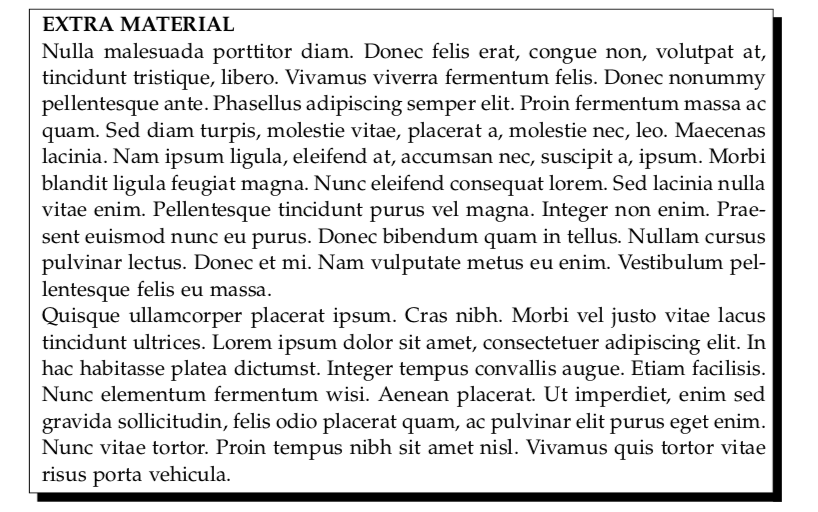
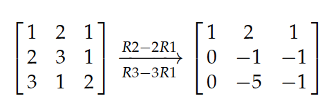

# LectureNotesUniversityOfGlasgow

#### Personal Lecture Notes CS Student - `Typeset in LaTeX`

Computer Science, Economics, Mathematics, Philosophy

The following notes were typeset using a modified version of [@stefano-maggiolo](https://github.com/stefano-maggiolo) custom class.

The modified version I'm using can be found in this repo [here](https://github.com/Joe-a-d/https://github.com/Joe-a-d/LectureNotesUniversityOfGlasgow/notes.cls). It has some neat additions like the following "one command macros" for:

Shadowed Box           |  SMatrices & EROs
:-------------------------:|:-------------------------:
 |  

The original can be found at Stefano Maggiolo's personal blog [here](http://blog.poormansmath.net/files/notes.cls), aling an interesting read on LaTeX "best-practices".

**N.B:** Besides the mods to Stefano's class, I've also included some shortcuts to common mathematical symbols, which can be found in the preamble of the tex files.

- Set Generator 
- Bold Vectors
- Code Font Environment
- Algorithm Environment
- Insert image from url 
